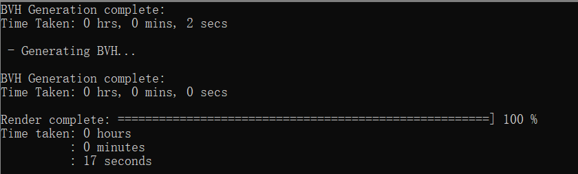
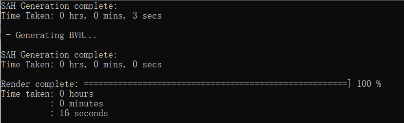
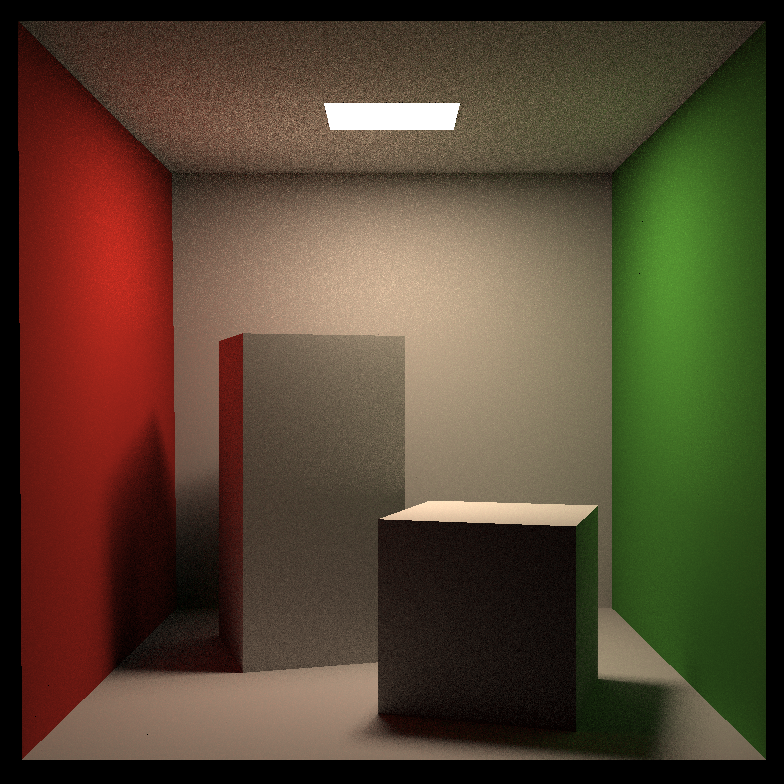
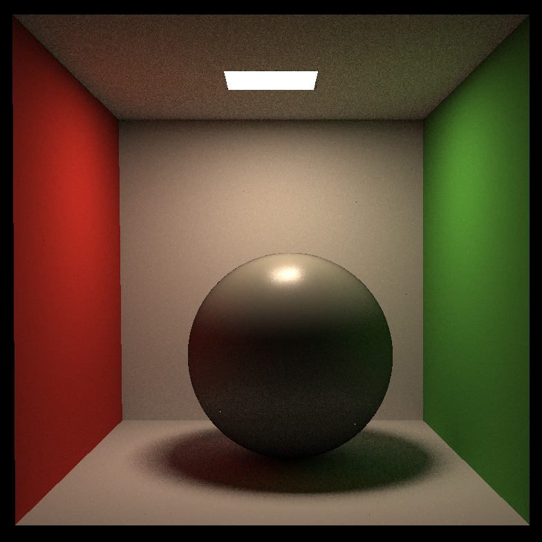

📌 2022/8/2 HW0：环境配置（我使用了Win本地的VS），简单的编程练手

📌 2022/8/2 HW1：编写几种矩阵变换，包含物体的旋转变化矩阵、物体到相机的投影矩阵

📌 2022/8/4 HW2：三角形的栅格化与着色；用super-sampling抗锯齿（bonus）

📌 2022/8/19 HW3：插值颜色、法向量、纹理坐标、位置，实现逐fragment着色；编写Blinn-phong反射模型，纹理贴图，凹凸贴图，位移贴图；（未完成bonus）

📌 2022/8/23 HW4：实现De Casteljau算法，递归绘出贝塞尔曲线；用多于4个控制点绘制贝塞尔曲线；实现对贝塞尔曲线的反走样，根据最近四个像素中心的距离来加权求像素点颜色。

📌 2022/8/24 HW5：由摄像机向各个像素点方向发出eye ray（此部分有参考[网络资料](https://blog.csdn.net/dong89801033/article/details/114834898?ops_request_misc=%257B%2522request%255Fid%2522%253A%2522162216944616780357298394%2522%252C%2522scm%2522%253A%252220140713.130102334.pc%255Fall.%2522%257D&request_id=162216944616780357298394&biz_id=0&utm_medium=distribute.pc_search_result.none-task-blog-2~all~first_rank_v2~rank_v29-2-114834898.pc_search_result_cache&utm_term=games101%E4%BD%9C%E4%B8%9A5&spm=1018.2226.3001.4187)）；实现Moller-Trumbore算法，判断射线与三角形是否相交。

📌 2022/8/29 HW6：实现光线与包围盒求交函数；实现 BVH 加速的光线与场景求交；自学并实现 SAH 加速（bonus），参考资料[讲解](https://zhuanlan.zhihu.com/p/349594815)和[代码](https://blog.csdn.net/qq_41765657/article/details/121865049)。BVH 16-17秒，SAH也16-17秒，区别不大，看网上别人跑出来有都6-7秒或2-3秒的，不理解...核对过不是代码问题，难道是机器问题？？我的VS应该不至于这么拉吧

📌 2022/9/3 HW7：实现现代光线追踪算法中的Path Tracing算法；用多线程分别渲染不同像素块，实现加速渲染（bonus）；实现Microfacet材质并完成渲染（bonus），参考[资料](https://blog.csdn.net/weixin_44518102/article/details/122698851?spm=1001.2101.3001.6650.9&utm_medium=distribute.pc_relevant.none-task-blog-2~default~BlogCommendFromBaidu~Rate-9.pc_relevant_default&depth_1-utm_source=distribute.pc_relevant.none-task-blog-2~default~BlogCommendFromBaidu~Rate-9.pc_relevant_default&utm_relevant_index=12)。

